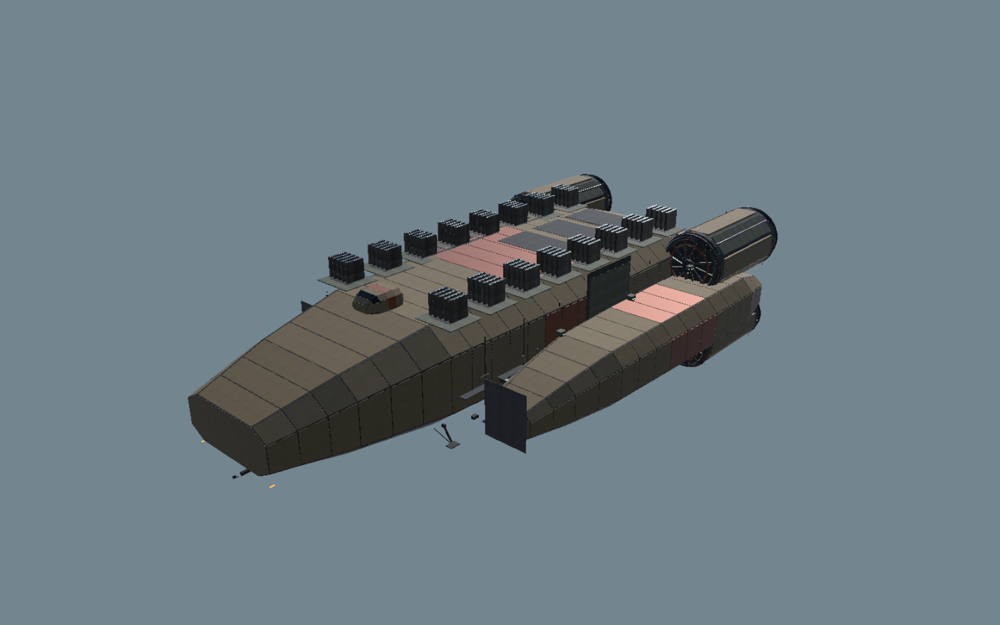
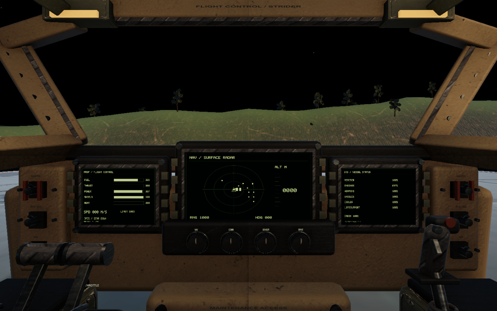

# Space Patriot — Unity restoration

Open this folder in Unity 6000.3.25f1, then open `Assets/SpacePatriot/Scenes/Frontier.unity` and enter Play mode. This is an incomplete restoration; see PORT_STATUS.md for actual scope and remaining work.

## Controls

- Walk: W/S forward/back, A/D strafe, Shift run, F board or leave the pilot seat, E/Z interact.
- Flight: hold Space to launch/ascend; Ctrl descends. W/S forward/reverse; A/D strafe. G retracts gear; X brakes.
- Aim: hold right mouse and move, or use arrow keys. Q/E roll. V changes camera; U aligns the horizon.
- Mouse wheel changes the speed limit. Shift boosts. T toggles assist. L requests landing assist.
- Cockpit: click the physical softkeys; scroll over NAV/COMM/SENSOR/DRIVE knobs to change their settings.
- Interior: F leaves the seat; WASD walks. E operates stations and bulkheads. At the service lift, E goes down and Shift+E goes up. Use the aft airlock to disembark.
- Community jobs and the settlement directory are in the Operations overview. District terminals record deliveries, checkpoints and repairs.
- Z/I changes cockpit instrument mode. Tab/M navigation; K fleet; Escape computer/menu.
- Y arms weapons; 1/2/3 select ship weapons, 1/2 select ground weapons; R reloads; C selects a target.
- Settings includes separate mouse/controller vertical inversion and mouse sensitivity. Normal mode means up looks up.
- Cargo: buy at the freight exchange, approach the cargo ramp, open the hatch and load. Unload before selling or handing over freight contracts. Close the hatch before launch.

The original source and artwork are retained under `Reference/Original`. The current fleet includes ten revised Blender-built exteriors, original specifications and new connected multideck interiors. The Downloads originals are untouched.

Grassworks, Spellworks, terrain, weather, ocean and fire behavior now have native Unity integrations. See [ENGINE_INTEGRATION.md](ENGINE_INTEGRATION.md) for exactly what runs and what remains incomplete. Rebuildable conversion tools are in [Tools/AssetPipeline](Tools/AssetPipeline).

## Development target

**Deliverable: the Unity project. Eventual release: an installable Windows PC game.** Browser delivery has been dropped. An installer will be prepared when the game is complete; this revision does not ship one.

Use Unity Hub to open this folder with **Unity 6000.3.25f1** and let its pinned packages import. Open `Assets/SpacePatriot/Scenes/Frontier.unity`, then press **Play**. Windows x64 is the active development target. No web server is required.

The future standalone player has window/fullscreen controls (F11), Save & Quit, and local JSON campaign saves with a previous-generation backup under `Application.persistentDataPath/saves`. Editor Play mode retains its existing PlayerPrefs save. Browser saves are not automatically migrated into the editor or desktop player.

`Space Patriot > Build Windows desktop` is available for later developer builds. Packaging and native-player verification are deferred; the current verification is in the Unity Editor. Historical WebGL tools and reports are retained as source history, not a delivery requirement.

Unity caches, local settings, generated builds and credentials are excluded from version control. Public source availability does not grant a new license; existing asset and package terms still apply.

Validation reports live under `Validation/`. Virtual-device tests exercise the running flight controller, cargo, MFD controls and deck lifts. They do not establish physical controller feel, art quality, full game completion or sustained performance.

## Current visual revision

Editor captures of the refitted chassis and continuous terrain. These are work in progress, not final artwork.

Editable fleet model: [SpacePatriot-Fleet.blend](ArtDirection/Production/SpacePatriot-Fleet.blend). See [society and art implementation](ArtDirection/DESIGN_AND_IMPLEMENTATION.md) for source references, rebuild order and remaining limits.
