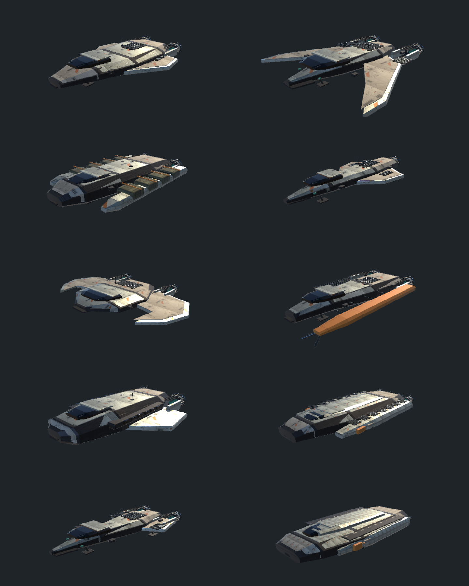
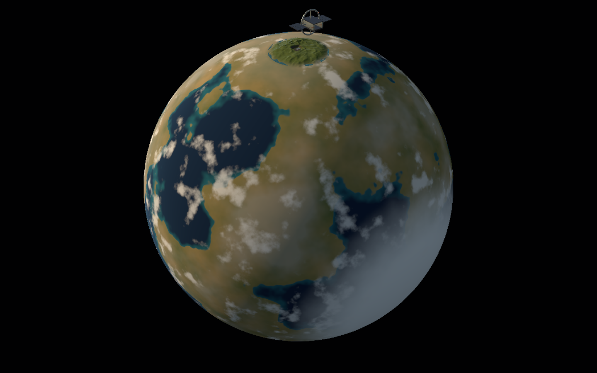

# Space Patriot — Unity restoration

Open this folder in Unity 6000.3.25f1, then open `Assets/SpacePatriot/Scenes/Frontier.unity` and enter Play mode. This is an incomplete restoration; see PORT_STATUS.md for actual scope and remaining work.

## Controls

- Walk: W/S forward/back, A/D strafe, Shift run, F board or leave the pilot seat, E/Z interact.
- Flight: hold Space to launch/ascend; Ctrl descends. W/S forward/reverse; A/D strafe. G retracts gear; X brakes.
- Aim: hold right mouse and move, or use arrow keys. Q/E roll. V changes camera; U aligns the horizon.
- Mouse wheel changes the speed limit. Shift boosts. T toggles assist. L requests landing assist.
- Z/I changes cockpit instrument mode. Tab/M navigation; K fleet; Escape computer/menu.
- Y arms weapons; 1/2/3 select ship weapons, 1/2 select ground weapons; R reloads; C selects a target.
- Settings includes separate mouse/controller vertical inversion and mouse sensitivity. Normal mode means up looks up.
- Cargo: buy at the freight exchange, approach the cargo ramp, open the hatch and load. Unload before selling or handing over freight contracts. Close the hatch before launch.

The original source and artwork are retained under `Reference/Original`. The current fleet includes ten industrial refits using the original atlas textures, specifications and interiors. The Downloads originals are untouched.

Grassworks, Spellworks, terrain, weather, ocean and fire behavior now have native Unity integrations. See [ENGINE_INTEGRATION.md](ENGINE_INTEGRATION.md) for exactly what runs and what remains incomplete. Rebuildable conversion tools are in [Tools/AssetPipeline](Tools/AssetPipeline).

## Build

Install Unity 6000.3.25f1 with Web Build Support, open this project and let its pinned packages import. Choose **Space Patriot > Build browser**. The build is written to a sibling `Browser` folder and requires an HTTP server that serves `.gz` files with the matching `Content-Encoding: gzip` and MIME type.

From the project directory, run `python Tools/serve_game.py`, then open `http://127.0.0.1:8791`. This development server binds only to this computer.

Unity caches, local settings, generated browser builds and credentials are excluded from version control. Public source availability does not grant a new license; existing asset and package terms still apply.

Validation reports live under `Validation/`. Tests using virtual input devices exercise the running controller code, but do not replace hands-on testing. No validated WebGL build is included yet.

## Current visual revision

Editor captures of the refitted chassis and continuous terrain. These are work in progress, not final artwork.

